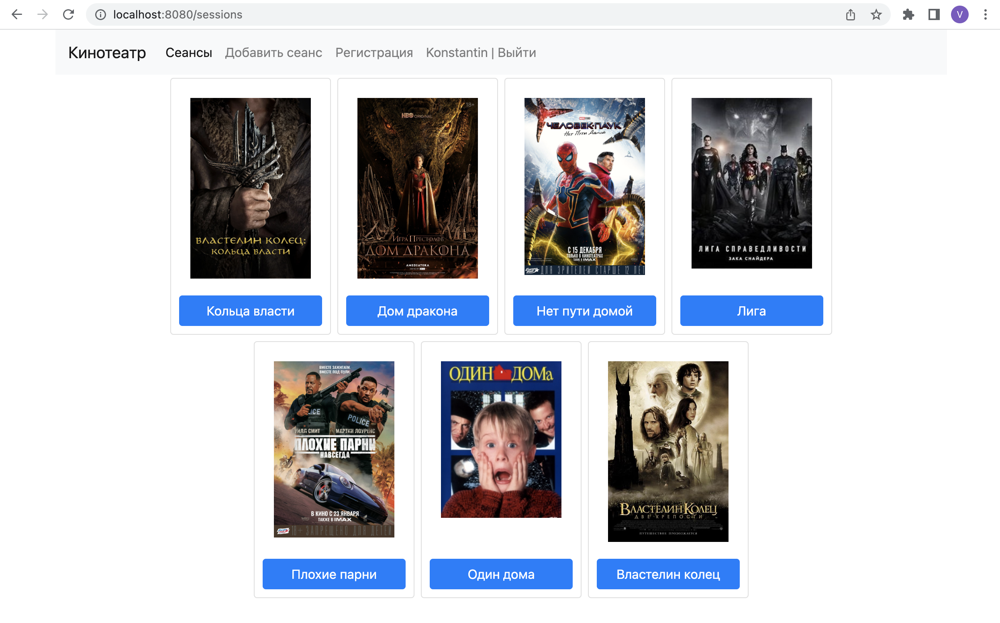
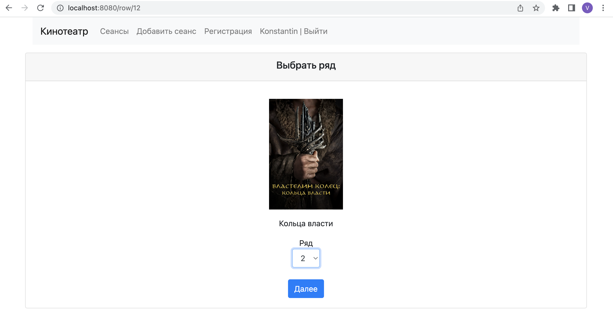
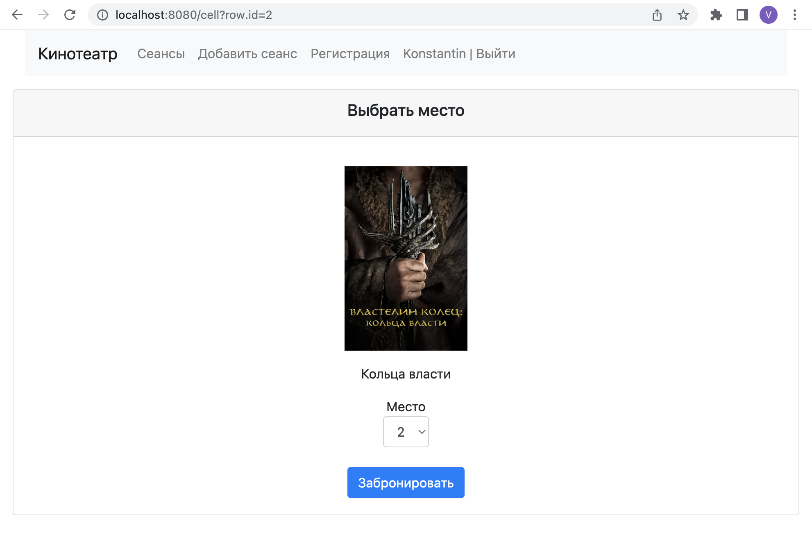
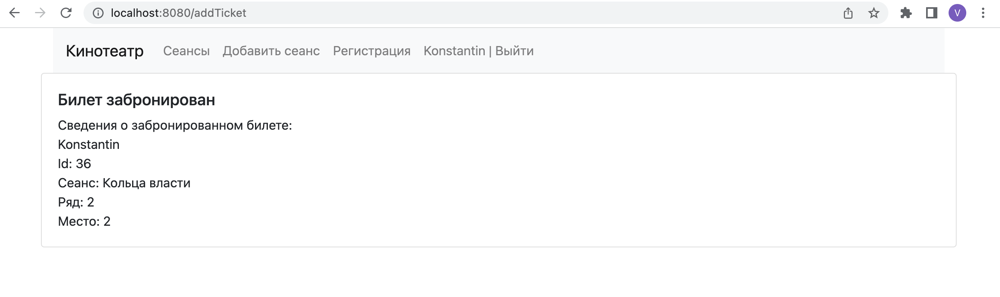
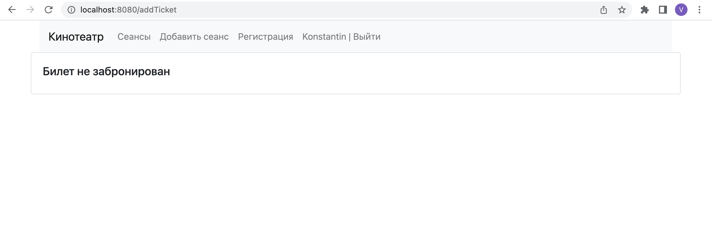
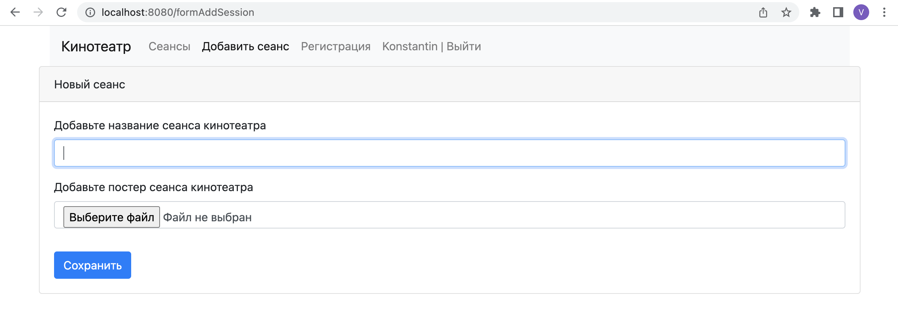
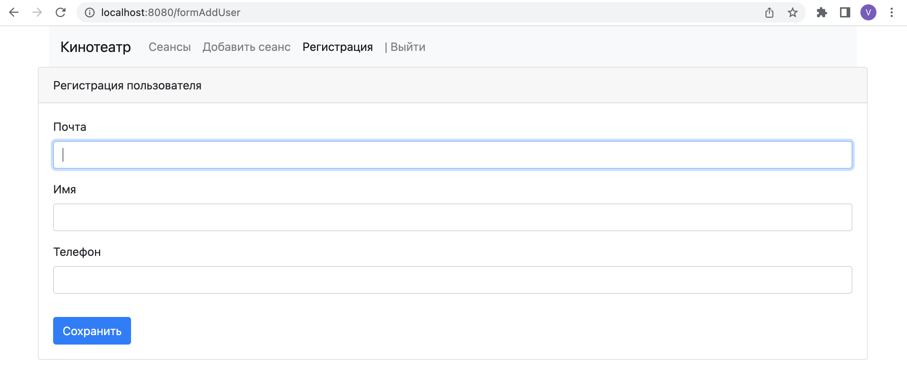
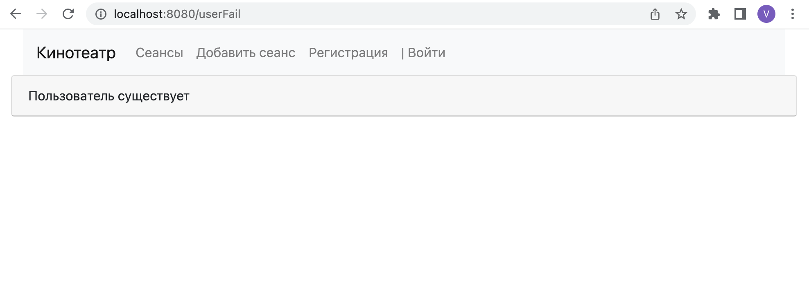
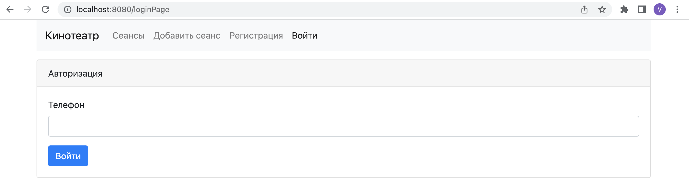
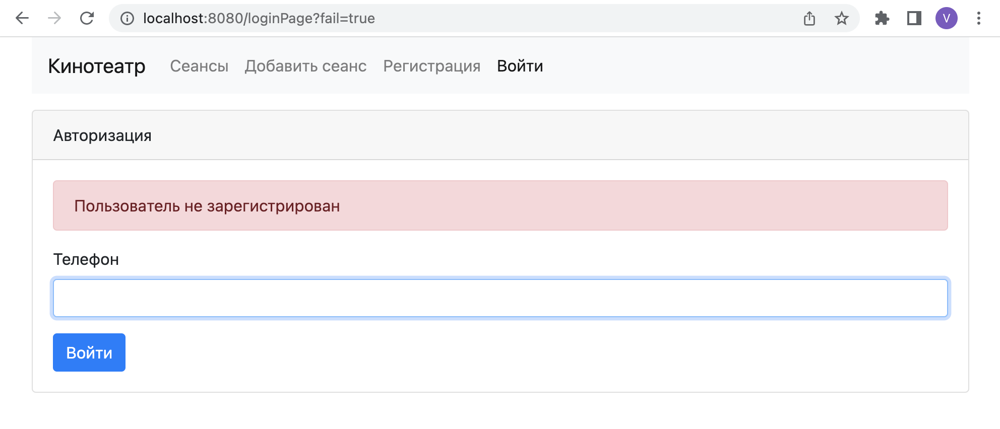

# job4j_cinema
Проект "Кинотеатр"

Веб приложение на языке Java с библиотекой Spring boot.

Сайт по покупке билетов в кинотеатр.
Главная страница форма выбор фильма. Пользователь кликает на фильм и переходит в бронирование.
Данные при переходе записываются в HttpSession. При бронирование показывается список доступных рядов и кнопка далее. Далее, отображаем список с выбором доступных мест и кнопка забронировать.
Последнее окно содержит информацию о бронирование билета.
Пользователь может не забронировать билет, потому что его выбрал другой пользователь. То есть одновременно выбрали одинаковые места.
Доступна регистрация и авторизация пользователей, а также добавление сеансов кинотеатра.

### Используемые технологии

### Сквозная функциональность реализована при помощи AOP Spring
- Идентификация ролей пользователей
- Журналирование сервисов
- Обработка исключений 
- Функция защиты: валидация входных данных пользователя
- Мониторинг сервисов и времени выполнения событий

### Архитектура приложения трехслойное
- Слой контроллеры
- Слой сервисы
- Слой работы с БД

### Требуемое окружение
- JDK 17
- Apache Maven 3.8.5
- PostgreSQL 13
- Браузер

### Подготовка к запуску приложения
- Создать БД cinema хост `jdbc:postgresql://localhost:5432/cinema`
- Собрать jar с приложением, выполнив команду `mvn install`
- Запустить приложение из папки target, выполнив команду: `java -jar job4j_cinema-1.0-SNAPSHOT.jar`
- Перейти в браузере по ссылке `http://localhost:8080/session`

### Главная страница, форма с выбором фильма

### Страница выбора ряда

### Страница выбора места

### Успешное бронироование билета

### Билет не забронирован

### Страница добавления нового сеанса

### Страница регистрации нового пользователя

### Пользователь существует

### Страница авторизации

### Пользователь не зарегистрирован

### Контакты
kanmikhaylov@gmail.com
